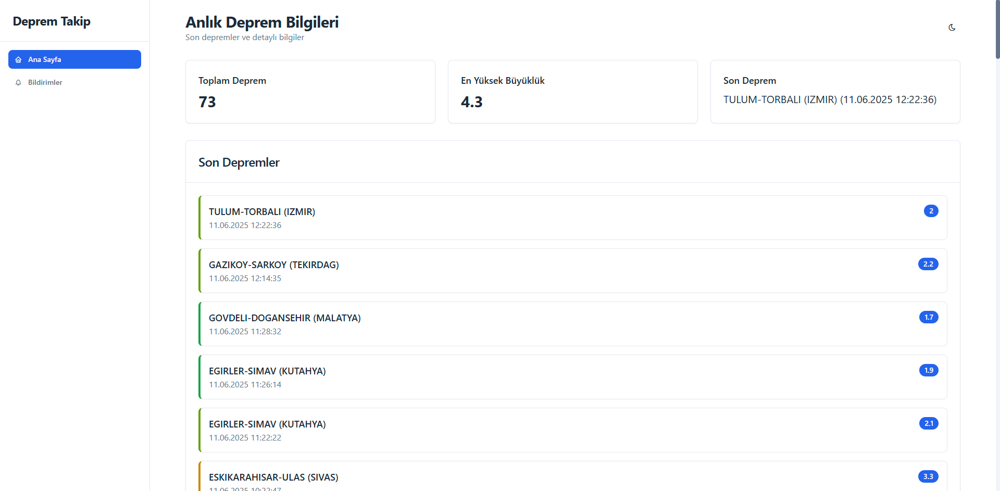
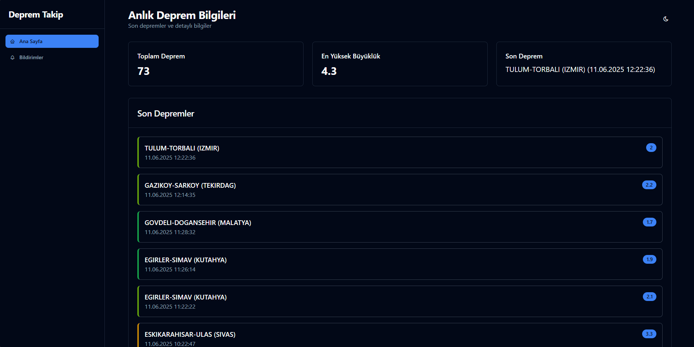

# 🌍 Deprem Takip Paneli

Türkiye'deki depremleri gerçek zamanlı olarak takip etmenizi sağlayan modern bir web uygulaması.



## 🚀 Özellikler

- **Gerçek Zamanlı Veri**: Kandilli Rasathanesi API'si üzerinden anlık deprem verilerini görüntüleme
- **Tarayıcı Bildirimleri**: Yeni deprem olduğunda anında bildirim alma
- **Karanlık/Aydınlık Tema**: Göz yorgunluğunu azaltmak için tema desteği
- **Mobil Uyumlu**: Tüm cihazlarda sorunsuz çalışan responsive tasarım
- **Otomatik Güncelleme**: Her 30 saniyede bir otomatik veri güncelleme

## 🛠️ Teknolojiler

- HTML5
- CSS3 (Tailwind CSS)
- JavaScript (ES6+)
- Service Workers
- Kandilli Rasathanesi API

## ⚡ Kurulum

1. Projeyi klonlayın:
```bash
git clone https://github.com/wexbie/sonDeprem.git
```

2. Proje dizinine gidin:
```bash
cd sonDeprem
```

3. Bir web sunucusu ile projeyi çalıştırın (örneğin: Live Server)

## 🌐 Canlı Demo

[https://sonDepremler.vercel.app](https://sonDepremler.vercel.app)

## 📱 Ekran Görüntüleri

### Aydınlık Tema


### Karanlık Tema


## 🤝 Katkıda Bulunma

1. Bu projeyi fork edin
2. Yeni bir branch oluşturun (`git checkout -b feature/yeniOzellik`)
3. Değişikliklerinizi commit edin (`git commit -am 'Yeni özellik: Detaylar'`)
4. Branch'inizi push edin (`git push origin feature/yeniOzellik`)
5. Pull Request oluşturun

## 📝 Lisans

Bu proje MIT lisansı altında lisanslanmıştır. Daha fazla bilgi için [LICENSE](LICENSE) dosyasına bakınız.

## 🙏 Teşekkürler

- [Kandilli Rasathanesi](http://www.koeri.boun.edu.tr/new/) - Deprem verilerini sağladıkları için
- [Tailwind CSS](https://tailwindcss.com/) - Harika CSS framework'ü için
- [Tabler Icons](https://tabler-icons.io/) - Güzel ikonlar için 